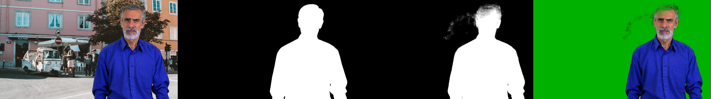
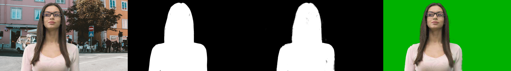

# HybridMatt — Real-Time Video Matting

A real-time video matting network that combines **ConvGRU** (long-term temporal memory, from [RVM](https://github.com/PeterL1n/RobustVideoMatting)) with **Spatial Attention** (short-term frame alignment, from [VideoMatt](https://github.com/AnyiRao/VideoMatt)) in a single decoder. Neither paper uses both mechanisms together — that is our contribution.

## Sample Results

Each row shows: **Input** | **Ground Truth Alpha** | **Predicted Alpha** | **Green-Screen Composite**






## Architecture

```
Input frames
     |
MobileNetV3-Large encoder
     |
LR-ASPP bottleneck
     |
HybridRecurrentDecoder
  |-- ConvGRU at every scale      (RVM   -- long-term memory)
  |-- SpatialAttention at 1/8, 1/4 (VideoMatt -- short-term alignment)
     |
Dual output head --> alpha matte + foreground
```

## Project Structure

```
HybridMatt/
├── model/                    # Network architecture
│   ├── model.py              #   HybridMattingNetwork (main model)
│   ├── decoder.py            #   HybridRecurrentDecoder (ConvGRU + SpatialAttention)
│   ├── spatial_attention.py  #   SpatialAttention module
│   ├── mobilenetv3.py        #   MobileNetV3 encoder
│   ├── resnet.py             #   ResNet50 encoder (alternative)
│   └── lraspp.py             #   LR-ASPP bottleneck
├── dataset/                  # Dataset loading & augmentation
│   ├── videomatte.py         #   VideoMatte240K loader
│   ├── augmentation.py       #   Frame sampling & augmentation
│   ├── spd.py                #   Supervisely Person Dataset
│   ├── coco.py               #   COCO Panoptic
│   └── youtubevis.py         #   YouTubeVIS
├── training/                 # Training pipeline
│   ├── train.py              #   Training loop (2-stage curriculum)
│   ├── train_config.py       #   Dataset paths (edit this)
│   └── train_loss.py         #   Loss functions (L1, Laplacian, temporal)
├── demo/                     # Web demo (Flask + MJPEG)
│   ├── app.py                #   Server-side webcam capture + inference
│   └── templates/
│       └── demo.html         #   Frontend UI
├── inference.py              # Run matting on a video file
├── evaluate.py               # Quantitative evaluation (MAD, MSE, dtSSD)
├── requirements.txt
├── REPORT.md                 # Detailed project report
└── README.md
```

---

## Setup

### 1. Install dependencies

```bash
python -m venv venv
source venv/bin/activate        # Linux/Mac
# venv\Scripts\activate         # Windows
pip install -r requirements.txt
```

### 2. Download datasets

**A. VideoMatte240K** (required) — foreground + alpha matte data (~5 GB, SD 480p JPEG version)

Download from: https://grail.cs.washington.edu/projects/background-matting-v2/

```
VideoMatte240K/
├── train/
│   ├── fgr/    (foreground frames)
│   └── pha/    (alpha mattes)
└── valid/
    ├── fgr/
    └── pha/
```

**B. Background images** (required) — BG-20K (20,000 background images)

Download from: https://github.com/JizhiziLi/GFM

```
Backgrounds/
├── train/
└── valid/
```

**C. Background videos** (optional)

A folder of video clips extracted as JPEGs. If you don't have these, point `background_videos` to the same folder as `background_images` in the config.

**D. Segmentation datasets** (optional — improves robustness)

- **Supervisely Person Dataset** (~1 GB)
- **COCO Panoptic** (~25 GB)
- **YouTubeVIS**

If you skip these, run training with `--no-seg`.

### 3. Set data paths

Edit `training/train_config.py` and fill in the paths to where you saved the datasets:

```python
DATA_PATHS = {
    'videomatte': {
        'train': '/path/to/VideoMatte240K/train',
        'valid': '/path/to/VideoMatte240K/valid',
    },
    'background_images': {
        'train': '/path/to/Backgrounds/train',
        'valid': '/path/to/Backgrounds/valid',
    },
    ...
}
```

### 4. Download pretrained RVM weights

Download `rvm_mobilenetv3.pth` from the [RVM releases](https://github.com/PeterL1n/RobustVideoMatting/releases) and place it in the project root. This is used as the starting checkpoint — we freeze the RVM layers and only train the new SpatialAttention parameters.

---

## Training

Training uses a 2-stage curriculum. All commands are run from the **project root**.

### Stage 1 — Short sequences

```bash
python -m training.train \
    --stage 1 \
    --checkpoint rvm_mobilenetv3.pth \
    --checkpoint-dir checkpoints/stage1 \
    --no-seg
```

### Stage 2 — Longer sequences (trains temporal memory)

```bash
python -m training.train \
    --stage 2 \
    --checkpoint checkpoints/stage1/best.pth \
    --checkpoint-dir checkpoints/stage2 \
    --no-seg
```

### Training parameters

| Parameter | Default | Description |
|---|---|---|
| `--stage` | required | Training stage (1 or 2) |
| `--checkpoint` | none | Path to starting weights (.pth) |
| `--checkpoint-dir` | required | Where to save checkpoints |
| `--no-seg` | false | Skip segmentation datasets |
| `--max-steps` | none | Stop after N steps (useful for fine-tuning) |
| `--batch-size` | 1 | Batch size |
| `--num-workers` | 4 | Dataloader workers |
| `--no-amp` | false | Disable mixed precision |
| `--save-interval` | 500 | Save checkpoint every N steps |

### Monitor training

```bash
tensorboard --logdir checkpoints/
```

Open `http://localhost:6006` in a browser to see loss curves.

---

## Inference

Run matting on a video file or folder of images:

```bash
python inference.py \
    --input /path/to/video.mp4 \
    --output-dir output/ \
    --checkpoint checkpoints/stage2/best.pth
```

### Inference parameters

| Parameter | Default | Description |
|---|---|---|
| `--input` | required | Path to video file or folder of images |
| `--output-dir` | required | Directory to save output videos |
| `--checkpoint` | required | Path to model checkpoint (.pth) |
| `--downsample-ratio` | 1.0 | Process at this fraction of resolution (0.5 = half, faster) |
| `--device` | auto | `cuda` or `cpu` |
| `--output-fps` | 30 | FPS for output videos |

**Outputs:**
- `alpha.mp4` — alpha matte (white = foreground)
- `composite.mp4` — person composited on green background
- `fgr.mp4` — foreground colour estimate

---

## Evaluation

Evaluate on the VideoMatte240K test set with standard matting metrics:

```bash
python evaluate.py \
    --checkpoint checkpoints/stage2/best.pth \
    --save-samples output/samples \
    --num-samples 30
```

### Evaluation parameters

| Parameter | Default | Description |
|---|---|---|
| `--checkpoint` | required | Path to model checkpoint |
| `--downsample-ratio` | 1.0 | Processing resolution fraction |
| `--save-samples` | none | Directory to save sample visual outputs |
| `--num-samples` | 30 | Number of sample frames to save |
| `--max-clips` | all | Limit to first N test clips |
| `--max-frames-per-clip` | 100 | Max frames per clip |

**Metrics:** MAD (Mean Absolute Difference), MSE (Mean Squared Error), dtSSD (temporal stability)

---

## Web Demo

Real-time matting from your webcam displayed in the browser.

```bash
python -m demo.app --checkpoint checkpoints/stage2/best.pth
```

Then open **http://localhost:5000**.

### Demo parameters

| Parameter | Default | Description |
|---|---|---|
| `--checkpoint` | required | Path to model checkpoint |
| `--downsample-ratio` | 0.5 | Lower = faster (0.5 recommended for real-time) |
| `--device` | auto | `cuda` or `cpu` |
| `--port` | 5000 | Server port |
| `--camera` | 0 | Camera index (0 = default webcam) |

The demo captures your webcam server-side and streams three MJPEG feeds to the browser: the raw input, the predicted alpha matte, and a green-screen composite.

---

## Troubleshooting

**Out of VRAM during training:** Reduce `--batch-size` to 1 or reduce sequence length by editing `STAGES` in `training/train.py`.

**Dataloader crashes / out of RAM:** Reduce `--num-workers` (try 2 or 0).

**NaN losses:** Add `--no-amp` to disable mixed precision.

**Checkpoint loads with warnings about unexpected keys:** Expected when loading RVM weights into HybridMatt — `strict=False` handles the 10 new SpatialAttention keys.

---

## References

1. Lin et al., "Robust High-Resolution Video Matting with Temporal Guidance" (2021) — [RVM](https://github.com/PeterL1n/RobustVideoMatting)
2. Li et al., "VideoMatt: Video Matting with Spatial Attention" (2023) — [VideoMatt](https://github.com/AnyiRao/VideoMatt)
